<div align="center">

<h1>META-EDM</h1>
<h3>A Validated Meta-Model for Enterprise Data Management<br>with Data Catalog Hub Architecture</h3>

<p>
  
  
  
  
  
</p>

<p><em>Supplementary research materials — full-resolution figures and UML source files</em></p>

</div>

---

## Overview

Enterprise data management lacks explicit theoretical foundations for domain decomposition and formalized structural interdependencies. This research develops **META-EDM**, a theoretically grounded meta-model comprising **twelve domains** organized in **four hierarchical layers**, with dependencies formalized through **modularity theory** and **Dependency Structure Matrix (DSM) methodology**.

Validated through a multi-method Design Science Research approach combining expert Delphi study (N=15) and large-scale practitioner survey (N=247).

---

## Research Questions

| | Question |
|:---:|---|
| **RQ1** | What are the necessary and sufficient domains of enterprise data management, and what theoretical principles govern their decomposition? |
| **RQ2** | How are EDM domains structurally interdependent, and how do these dependencies inform architectural design and implementation sequencing? |
| **RQ3** | What is the structural role of the data catalog within the EDM ecosystem, and does it function as an architectural hub? |

---

## META-EDM Four-Layer Architecture

```
╔══════════════════════════════════════════════════════════════════╗
║  LAYER 4 — DISCOVERY        D10: Data Catalog    D11: Search    ║
╠══════════════════════════════════════════════════════════════════╣
║  LAYER 3 — ORCHESTRATION    D8: Governance       D9: Lineage    ║
╠══════════════════════════════════════════════════════════════════╣
║  LAYER 2 — ENRICHMENT       D5: Metadata         D6: Quality    ║
║                              D7: Security         D12: Profiling ║
╠══════════════════════════════════════════════════════════════════╣
║  LAYER 1 — FOUNDATION       D1: Sources          D2: Processing ║
║                              D3: Storage          D4: Core Assets║
╚══════════════════════════════════════════════════════════════════╝
                        ▲ Dependencies flow upward
```

**Key finding:** Data Catalog (D10) functions as an architectural hub, integrating outputs from nine upstream domains. Organizations with mature upstream capabilities report **3.7× higher satisfaction** than those with premature catalog deployments (Cohen's d = 3.8).

---

## Complete UML Meta-Model

The diagram below presents the complete META-EDM across all 12 domains, their classes, attributes, methods, and inter-package relationships.
**[View Figure — Full UML Meta-Model ](figures/EDM_METAMODEL_UML.svg)**


> META-EDM Enterprise Data Catalog Meta-Model — Full UML Class Diagram.
> *12 packages · 70+ classes · 7 enumerations · Complete inter-domain dependency model.*

📐 **Editable UML source:** [`uml/META_EDM_UML.puml`](uml/META_EDM_UML.puml)

---

## Domain Specifications (Appendix)

Each domain is formally specified as a UML class diagram. The twelve domains are organized by architectural layer.

---

### Layer 1 — Foundation Domains

#### D1 — Data Sources
Manages all external and internal data origins (structured, semi-structured, unstructured).


---

#### D2 — Data Processing
Covers ingestion pipelines, transformations, batch and streaming processes.

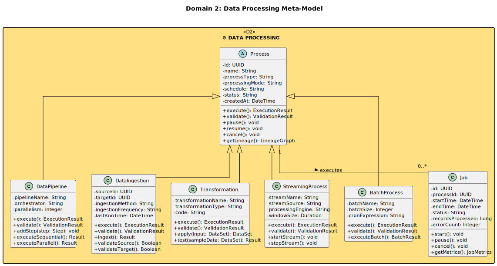

---

#### D3 — Data Storage
Manages storage infrastructure: data lakes, warehouses, lakehouses, and object storage.

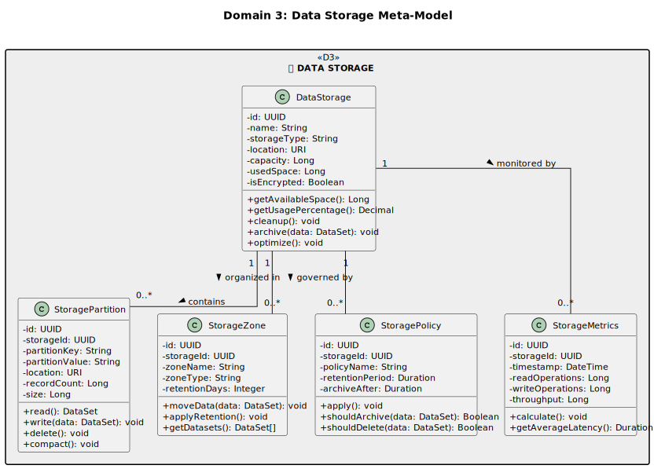

---

#### D4 — Core Data Assets
Central abstraction layer defining all typed data assets (tables, columns, files, datasets, APIs).

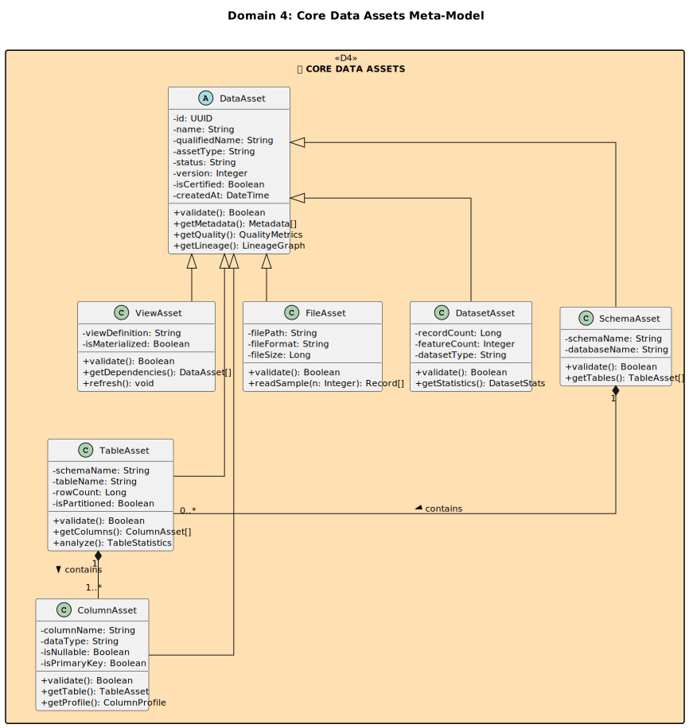

---

### Layer 2 — Enrichment Domains

#### D5 — Metadata
Captures technical, business, operational, and descriptive metadata for all data assets.

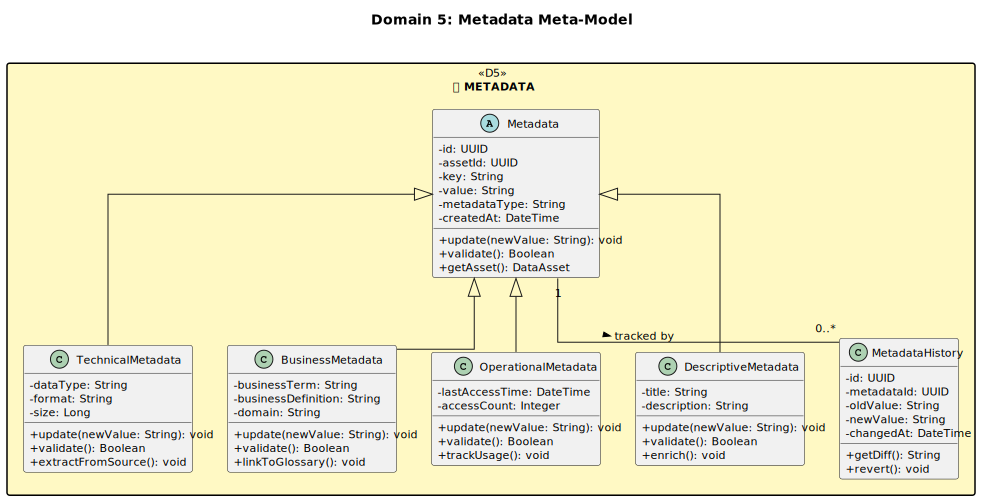

---

#### D6 — Data Quality
Defines quality dimensions, rules, and automated checks applied across the data ecosystem.

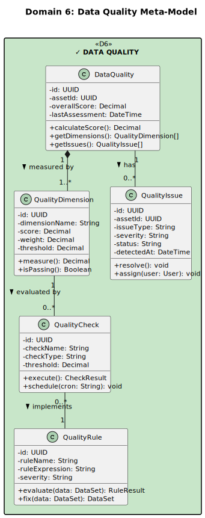

---

#### D7 — Data Security
Manages access control, sensitivity classification, roles, permissions, and audit trails.

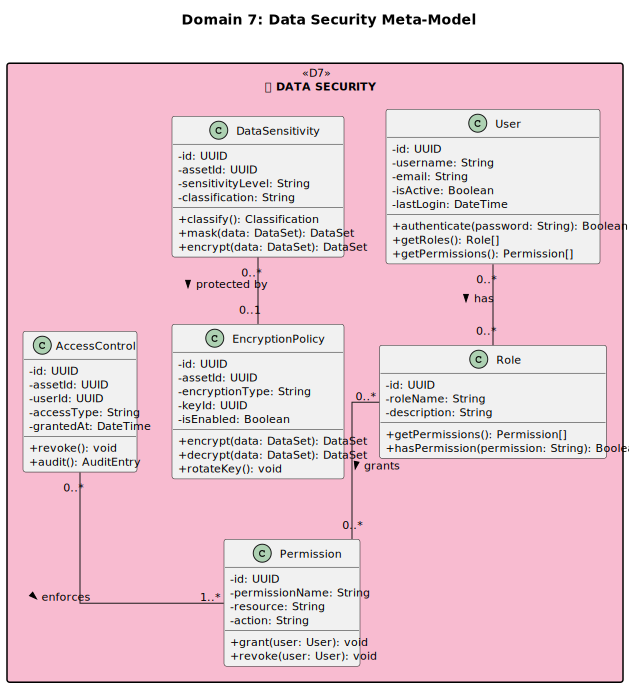

---

#### D12 — Data Profiling
Provides statistical analysis and column-level profiling to support quality and discovery.

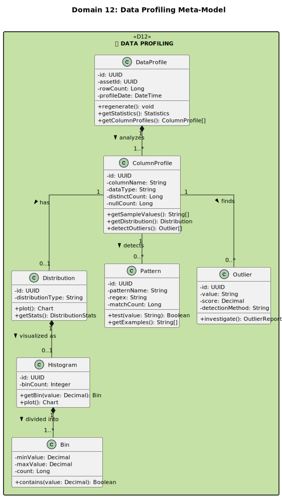

---

### Layer 3 — Orchestration Domains

#### D8 — Data Governance
Defines ownership, stewardship, policies (usage, retention), and compliance enforcement.

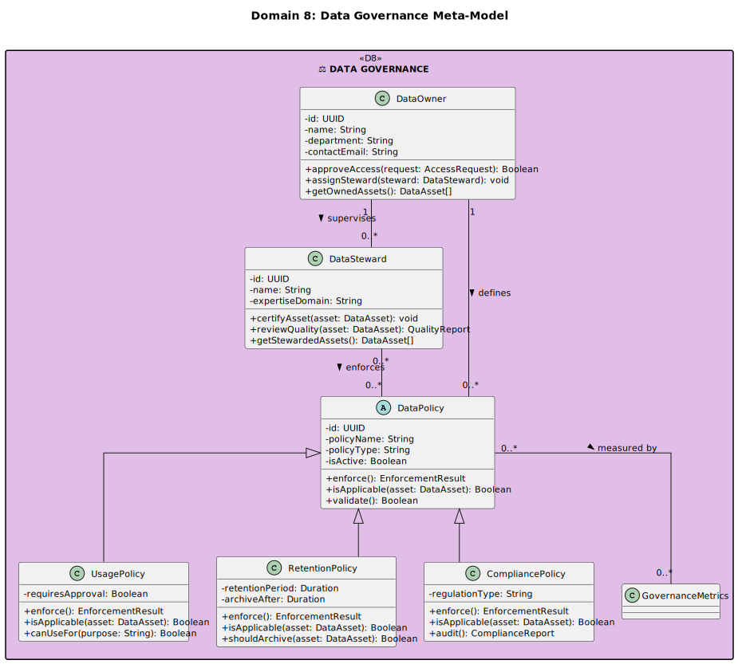

---

#### D9 — Data Lineage
Tracks provenance, transformation history, version control, and impact analysis across assets.

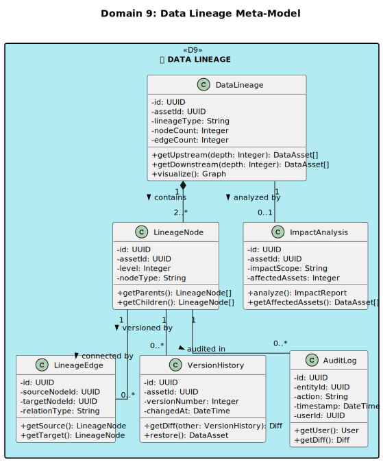

---

### Layer 4 — Discovery Domains

#### D10 — Data Catalog
Hub domain aggregating outputs from nine upstream domains to enable enterprise data discovery.

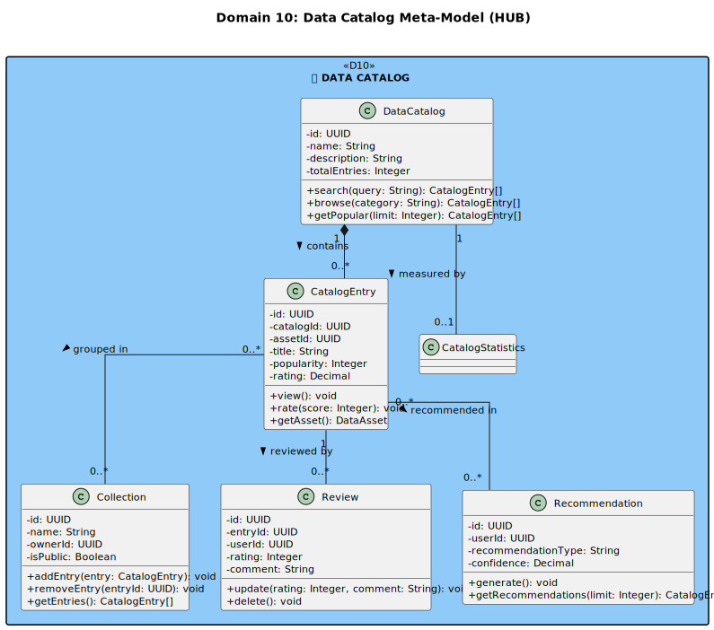

---

#### D11 — Data Search
Provides full-text indexing, tagging, glossary management, and semantic search capabilities.

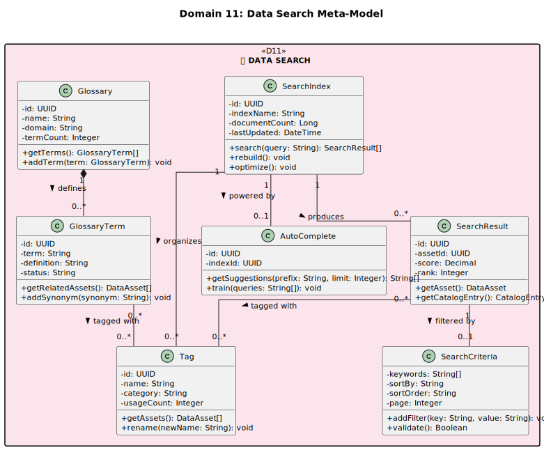

---

## Empirical Validation Results

### Expert Delphi Study — N=15

| Validation Criterion | Result |
|---|:---:|
| Overall domain necessity consensus | **84.0%** |
| Dependency structure agreement | **91.2%** |
| Catalog hub position consensus | **88.7%** |
| Inter-round stability (Kendall's W) | **0.73** *(p < 0.001)* |

### Practitioner Survey — N=247

| Empirical Finding | Effect Size |
|---|:---:|
| Catalog satisfaction ↔ upstream maturity | **r = 0.74** *(p < 0.001)* |
| Satisfaction: mature vs. premature deployment | **3.7× higher** *(Cohen's d = 3.8)* |
| Maturity: consistent vs. inconsistent sequences | **2.3× higher** |
| Stakeholder satisfaction gain | **1.9× higher** |

### Cross-Method Triangulation

Expert and practitioner assessments converge within **3.4 percentage points**, confirming strong cross-method validity.

---

## Repository Structure

```
meta-edm/
│
├── README.md
│
├── figures/
│   ├── EDM_META.svg                         ← Complete UML meta-model
│   │
│   └── appendix/                           ← Appendix: Domain-level diagrams
│       ├── fig1_D1_data_sources.png
│       ├── fig2_D2_data_processing.png
│       ├── fig3_D3_data_storage.png
│       ├── fig4_D4_core_assets.png
│       ├── fig5_D5_metadata.png
│       ├── fig6_D6_data_quality.png
│       ├── fig7_D7_data_security.png
│       ├── fig8_D8_data_governance.png
│       ├── fig9_D9_data_lineage.png
│       ├── fig10_D10_data_catalog.png
│       ├── fig11_D11_data_search.png
│       └── fig12_D12_data_profiling.png
│
└── uml/
    └── META_EDM_UML.puml                     ← PlantUML editable source
```

---

## Rendering the UML Source

```bash
# Render to high-resolution PNG (300 dpi)
plantuml -tpng -Sdpi=300 uml/META_EDM_UML.puml

# Render to scalable vector (SVG)
plantuml -tsvg uml/META_EDM_UML.puml
```

Or use the online renderer: [plantuml.com/plantuml](https://www.plantuml.com/plantuml)

---

## License

This repository is released under **Creative Commons Attribution 4.0 International (CC BY 4.0)**.
You are free to share and adapt the materials with appropriate attribution.

[](https://creativecommons.org/licenses/by/4.0/)

---

<div align="center">
<sub>All figures comply with publication artwork standards (≥ 300 dpi). Author information withheld pending peer review.</sub>
</div>
